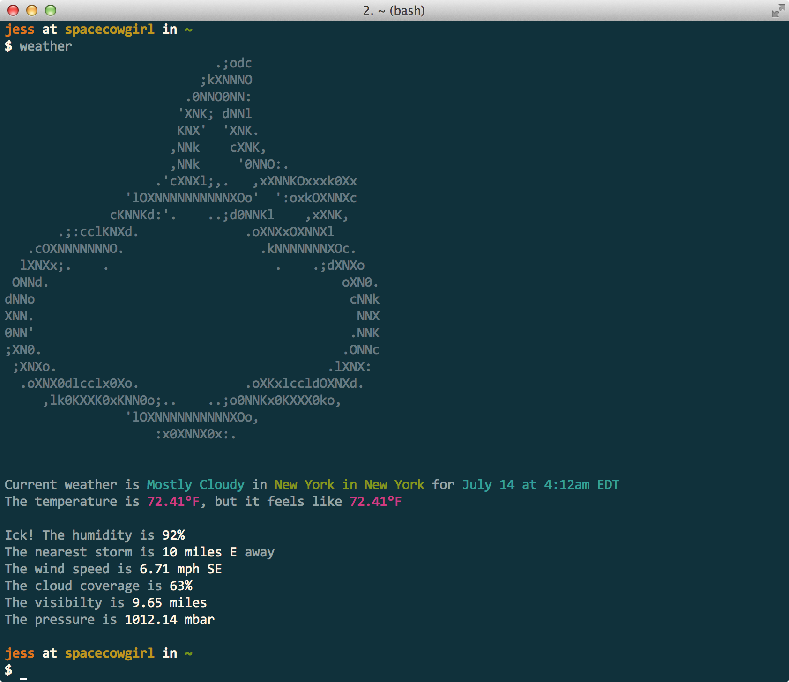

# weather

[](https://travis-ci.org/jessfraz/weather)

Weather via the command line. Uses the [darksky.net](https://darksky.net) API so it's super accurate. Also includes any current weather alerts in the output.



## Installation

#### Binaries

- **darwin** [386](https://github.com/jessfraz/weather/releases/download/v0.10.0/weather-darwin-386) / [amd64](https://github.com/jessfraz/weather/releases/download/v0.10.0/weather-darwin-amd64)
- **freebsd** [386](https://github.com/jessfraz/weather/releases/download/v0.10.0/weather-freebsd-386) / [amd64](https://github.com/jessfraz/weather/releases/download/v0.10.0/weather-freebsd-amd64)
- **linux** [386](https://github.com/jessfraz/weather/releases/download/v0.10.0/weather-linux-386) / [amd64](https://github.com/jessfraz/weather/releases/download/v0.10.0/weather-linux-amd64) / [arm](https://github.com/jessfraz/weather/releases/download/v0.10.0/weather-linux-arm) / [arm64](https://github.com/jessfraz/weather/releases/download/v0.10.0/weather-linux-arm64)
- **solaris** [amd64](https://github.com/jessfraz/weather/releases/download/v0.10.0/weather-solaris-amd64)
- **windows** [386](https://github.com/jessfraz/weather/releases/download/v0.10.0/weather-windows-386) / [amd64](https://github.com/jessfraz/weather/releases/download/v0.10.0/weather-windows-amd64)

#### Via Go

```bash
$ go get github.com/jessfraz/weather
```

## Usage

- **`--location, -l`:** Your address, can be in the format of just a zipcode or a city, state, or the full address. **defaults to auto locating you based off your ip**
- **`--units, -u`:** The unit system to use. **defaults to `auto`**, other options are `us`, `si`, `uk`, `uk2`, `ca`
    for more information on units see [the darksky.net api](https://darksky.net/dev/docs/forecast)
- **`--days, -d`:** Days of weather to retrieve. **defaults to the current weather, ie. 0 or 1**
- **`--ignore-alerts`:** Don't print alerts in weather output. **defaults false**
- **`--hide-icon`:** Hide the weather icons from being output. **defaults false**
- **`--server, -s`:** Weather API server uri **defaults to  "https://geocode.jessfraz.com"**


### Examples

```bash
# get the current weather in your current location
$ weather

# change the units to metric
$ weather -l "Paris, France" -u si

# it will auto guess the units though so changing
# the location to paris will change the units to `si`
$ weather -l "Paris, France"

# get three days forecast for NY
$ weather -l 10028 -d 3

# or you can autolocate and get three days forecast
$ weather -d 3

# get the weather in Manhattan Beach, CA
# even includes alerts
$ weather -l "Manhattan Beach, CA"
#                             .;odc
#                           ;kXNNNO
#                         .0NNO0NN:
#                        'XNK; dNNl
#                        KNX'  'XNK.
#                       ,NNk    cXNK,
#                       ,NNk     '0NNO:.
#                     .'cXNXl;,.   ,xXNNKOxxxk0Xx
#                 'lOXNNNNNNNNNNXOo'  ':oxkOXNNXc
#               cKNNKd:'.    ..;d0NNKl    ,xXNK,
#        .;:cclKNXd.              .oXNXxOXNNXl
#    .cOXNNNNNNNO.                  .kNNNNNNNXOc.
#   lXNXx;.    .                      .    .;dXNXo
#  ONNd.                                       oXN0.
# dNNo                                          cNNk
# XNN.                                           NNX
# 0NN'                                          .NNK
# ;XN0.                                        .ONNc
#  ;XNXo.                                    .lXNX:
#   .oXNX0dlcclx0Xo.              .oXKxlccldOXNXd.
#      ,lk0KXXK0xKNN0o;..    ..;o0NNKx0KXXX0ko,
#                 'lOXNNNNNNNNNNXOo,
#                     :x0XNNX0x:.
#
#
# Current weather is Partly Cloudy in Manhattan Beach in California for July 14 at 4:14am EDT
# The temperature is 69.2°F, but it feels like 69.2°F
#
# Special Weather Statement for Los Angeles, CA
# ...THREAT OF MONSOONAL THUNDERSTORMS LATE TONIGHT THROUGH WEDNESDAY...
# A STRONG UPPER LEVEL HIGH PRESSURE SYSTEM CURRENTLY CENTERED OVER NEVADA
# WILL BRING INCREASING EAST TO SOUTHEAST FLOW OVER SOUTHERN
# CALIFORNIA. AS A RESULT...A SIGNIFICANT SURGE OF MONSOONAL MOISTURE
# WILL MOVE INTO SOUTHWEST CALIFORNIA LATE TONIGHT THROUGH WEDNESDAY.
# THE GREATEST THREAT OF SHOWERS AND THUNDERSTORMS WILL BE ACROSS THE
# MOUNTAINS AND ANTELOPE VALLEY LATE TONIGHT INTO TUESDAY. DUE TO THE
# EASTERLY UPPER LEVEL FLOW ON MONDAY...THERE WILL ALSO BE A SLIGHT
# CHANCE OF SHOWERS AND THUNDERSTORMS ACROSS MOST COASTAL AND VALLEY
# AREAS.
# THE DEEPER MONSOONAL MOISTURE WILL BRING THE POTENTIAL FOR BRIEF HEAVY
# RAINFALL WITH STORMS THAT DEVELOP ON MONDAY AND TUESDAY...ESPECIALLY
# ACROSS THE MOUNTAINS AND ANTELOPE VALLEY. WHILE STORMS ARE EXPECTED
# TO BE FAST MOVING...THERE WILL BE THE POTENTIAL FOR LOCALIZED FLOODING
# OF ROADWAYS AND ARROYOS. ON TUESDAY...THE THREAT OF THUNDERSTORMS IS
# EXPECTED TO REMAIN CONFINED TO THE MOUNTAINS AND DESERTS. WITH WEAKER
# UPPER LEVEL WINDS ON TUESDAY...STORMS WILL LIKELY MOVE SLOWER. AS A
# RESULT...THERE WILL BE AN INCREASED THREAT OF FLASH FLOODING.
# IT WILL NOT BE AS HOT ACROSS MUCH OF THE REGION TOMORROW DUE TO THE
# INCREASED MOISTURE AND CLOUD COVERAGE...WITH INTERIOR SECTIONS
# GENERALLY REMAINING IN THE 90S. HOWEVER...THERE WILL BE A
# SIGNIFICANT INCREASE IN HUMIDITY ON MONDAY THAT WILL CONTINUE TO
# BRING DISCOMFORT.
# ANYONE PLANNING OUTDOOR ACTIVITIES IN THE MOUNTAINS AND DESERTS
# DURING THE NEXT FEW DAYS SHOULD CAREFULLY MONITOR THE LATEST
# NATIONAL WEATHER SERVICE FORECASTS AND STATEMENTS DUE TO THE
# POTENTIAL HAZARDS ASSOCIATED WITH THUNDERSTORMS.
#             Created: July 13 at 10:50pm EDT
#             Expires: July 14 at 7:00pm EDT
#
# Ick! The humidity is 85%
# The nearest storm is 18 miles NE away
# The wind speed is 3.96 mph SE
# The cloud coverage is 35%
# The visibility is 9.58 miles
# The pressure is 1012.99 mbar
```

## Makefile Usage

```console
$ make help
all                            Runs a clean, build, fmt, lint, test, vet and install
build                          Builds a dynamic executable or package
clean                          Cleanup any build binaries or packages
cross                          Builds the cross compiled binaries, creating a clean directory structure (eg. GOOS/GOARCH/binary)
fmt                            Verifies all files have men `gofmt`ed
install                        Installs the executable or package
lint                           Verifies `golint` passes
release                        Builds the cross compiled binaries, naming them in such a way for release (eg. binary-GOOS-GOARCH)
tag                            Create a new git tag to prepare to build a release
test                           Runs the go tests
vet                            Verifies `go vet` passes
```

[](https://github.com/jessfraz/weather)
